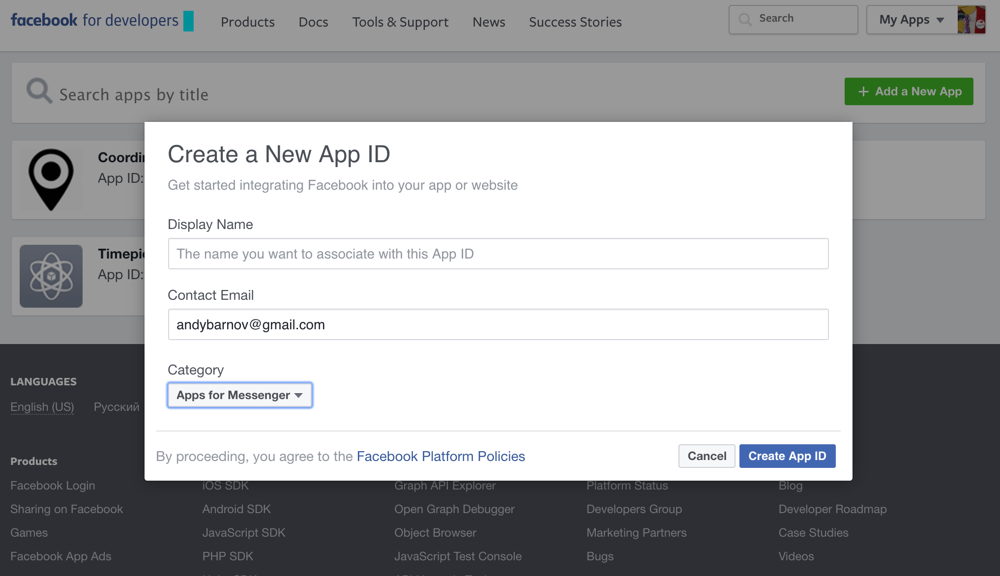
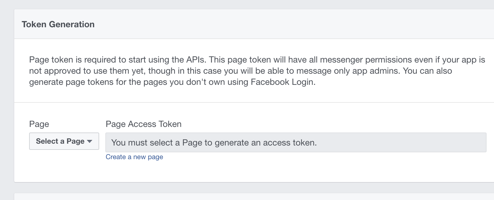
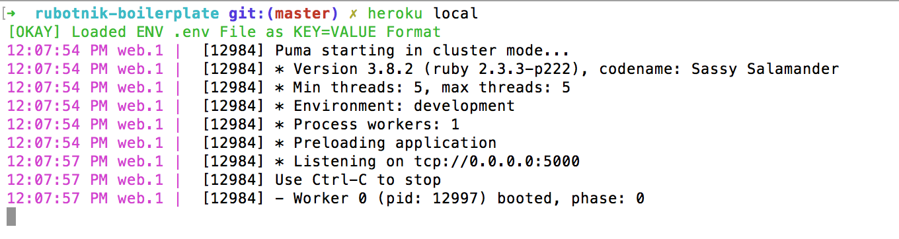
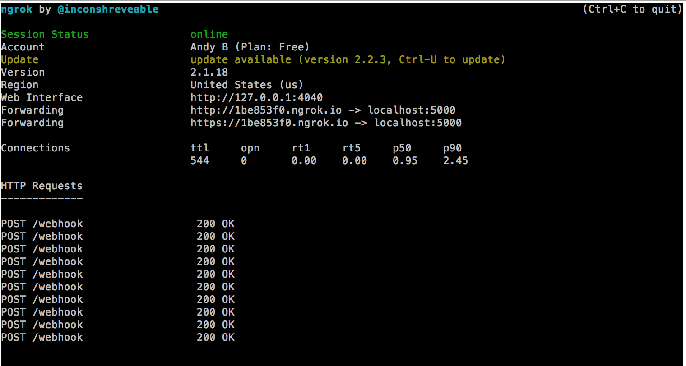
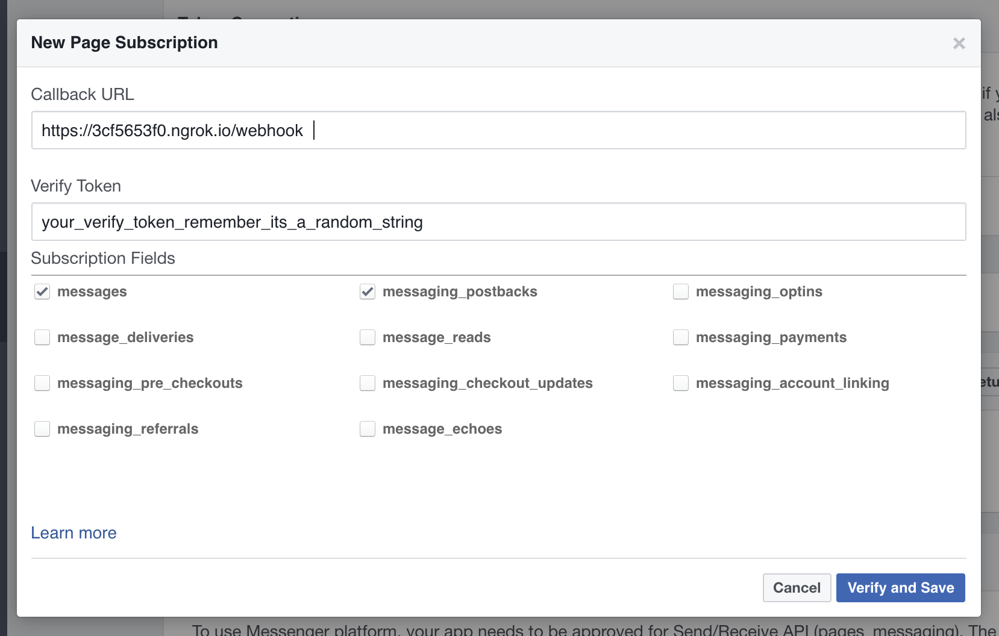
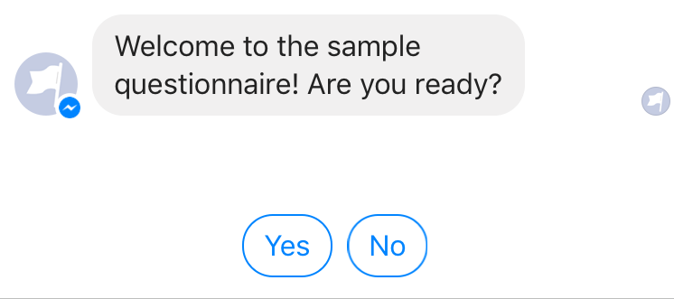
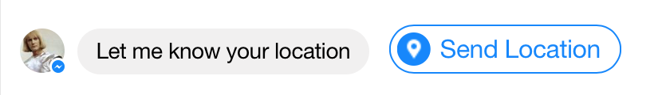
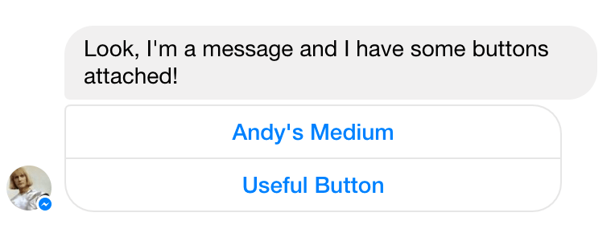
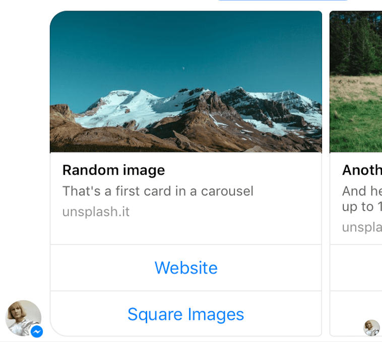

*"We are the robots / Ya tvoi sluga / Ya tvoi rabotnik"  — Kraftwerk*

# Rubotnik
### All you need to launch your own functional Ruby bot for Facebook Messenger FAST

[Read on Medium](https://hackernoon.com/ya-tvoy-rubotnik-beginner-friendly-ruby-boilerplate-to-build-your-own-messenger-bot-9e5fc35ee53b) | [Talk to Demo Bot](http://m.me/455827908083164/)

It's as easy as:

1. Clone the boilerplate.
2. Customize message bindings and commands for your bot.
3. Push your bot to Heroku and review it with Facebook.
4. You're live! :speech_balloon:

**Rubotnik is a minimalistic boilerplate** and *a microframework proof-of-concept* that allows you to launch your functional bot on a Messenger Platform in a matter of minutes. It is a companion to ingenious [facebook-messenger](https://github.com/hyperoslo/facebook-messenger) gem and piggybacks on its `Bot.on :event` triggers. The main promise of **Rubotnik** is to speed up bot development in Ruby and provide a more natural mental model for bot-user interactions.

**Rubotnik** is also **very** beginner friendly :baby: :baby_bottle: and can be used in class to teach programming students about bots.

**Rubotnik** comes with a bare-bones architecture that ensures multiple users are served without delays or overlaps. It also provides a single shared namespace for everything your bot can do, so your bot's "commands" can be easily bound to incoming messages (or [postbacks](https://developers.facebook.com/docs/messenger-platform/webhook-reference/postback)) through intuitive DSL, like so (strings are treated as case-insensitive regexps):

```ruby

# Will match any of the words
bind "hello", "hi", "bonjour", "привет" to: :my_method_for_greeting

# Will match only if all words are present (ignoring order)
bind "what", "time", "is", all: true, to: :tell_time

# Same logic for postbacks
bind "ACTION_BUTTON", to: :action_for_button

```

**Note**: multiple commands may be matched from a single message, in that case commands
will be executed in order of matching.  

"Talking" to the connected user is as straightforward as it gets:

```ruby
say "Hello!"
```

You can provide hints to the user in the form of quick replies:

```ruby

replies = UI::QuickReplies.build(["Yes", "YES"], ["No", "NO"])
# Builds an array of hashes:
# [{:content_type=>"text", :title=>"Yes", :payload=>"YES"},
# {:content_type=>"text", :title=>"No", :payload=>"NO"}]

say "Do you want to see more?", quick_replies: replies
# Creates and sends this hash through Facebook Messenger Platform API:
#  {
#   recipient: {
#     id: "USER_ID"
#   },
#   message: {
#     text: "Do you want to see more?",
#     "quick_replies":[
#       {
#         content_type: "text",
#         title: "Yes",
#         payload: "YES"
#       },
#       {
#         content_type: "text",
#         title: "No",
#         payload: "NO"
#       }
#     ]
#   }
# }

```
**Implementing conversation threads** is like composing a movie script. Your bot is in constant dialogue with the user: each command starts by handling user's answer to your previous question and ends with posing a new one:

```ruby
# bot.rb
bind "nice to meet you", to: :handle_name_and_ask_age, start_thread: {
                                                  message: "What's your name?"
                                                }

# commands.rb
def handle_name_and_ask_age
  # @message references an incoming message from the user
  # We assume it's a reaction to your previous message
  name = @message.text
  # ... do something with the data ...
  say "Hello, #{name}!"
  say "How old are you?"
  next_command :handle_age_and_ask_smth_else
end

def handle_age_and_ask_smth_else
  # ...
end
```

**Rubotnik** does not depend on any database out of the box and runs on Rack, so it functions as a **self-contained web app** (primed for [Heroku](https://heroku.com)). It can work with your main project through the REST API and use its database for persistence. The default server is Puma, but you can use any other Rack webserver for production or development (note that in-memory user store  does not support parallelism through processes and a Puma server can only run with **one "worker"**, multiple *threads* are fine).

[Sinatra](http://www.sinatrarb.com/) is enabled inside the boilerplate by default, and you can use its familiar syntax to define new webhooks for incoming API calls.  

A built-in set of convenience classes makes working with Messenger Platform less tedious (you don't need to hardcode huge nested JSONs/hashes anymore to use basic interface features, just call one of the builder classes inside **UI** module).  

_**DISCLAIMER:** I am a new programmer and a recent [Le Wagon](https://www.lewagon.com/) graduate, passionate about all things Ruby. This is my first attempt at framework design and OSS. I welcome any discussion that can either push this project forward (and turn it into a separate gem), or prove its worthlessness. Please, star this repo if you want me to carry on._

## Installation
Assuming you are going to use this boilerplate as a starting point for your own bot:

```bash
git clone git@github.com:progapandist/rubotnik-boilerplate.git

mv rubotnik-boilerplate YOUR_PROJECT_NAME

cd YOUR_PROJECT_NAME

rm -rf .git # to delete boilerplate's git history
git init # to start tracking your own project

bundle install
```

Now open the boilerplate in your favorite text editor and let's take a look at the structure

## Directory structure

```bash
.
├── Gemfile
├── Gemfile.lock
├── Procfile
├── README.md # this readme
├── bot.rb # <= !!! YOUR STARTING POINT !!!
├── commands # everything in this folder will become
             # private methods for Dispatch classes
│   ├── commands.rb # write your commands as methods here
│   ├── questionnaire.rb # or in one of associated modules
│   └── show_ui_examples.rb
├── config
│   └── puma.rb # a configuration file for Puma
├── config.ru
├── demo # Constants for UI elements used in the demo.
         # you are free to delete this folder  
│   └── sample_elements.rb
├── helpers # general helpers mixed into bot.rb
            # and accessible from everywhere inside the boilerplate   
│   └── helpers.rb
├── privacy_policy.pdf  # replace with your own for FB approval
├── rubotnik # an embryo for the framework
│   ├── bot_profile.rb
│   ├── message_dispatch.rb
│   ├── persistent_menu.rb # design your persistent menu here
│   ├── postback_dispatch.rb
│   ├── rubotnik.rb
│   ├── user.rb # User model, define your own containers for state
│   └── user_store.rb # in-memory storage for users
└── ui # convenience classes to build UI elemens
    ├── fb_button_template.rb
    ├── fb_carousel.rb
    ├── image_attachment.rb
    ├── quick_replies.rb
    └── ui.rb

```

# Setup

## Facebook setup pt. 1. Tokens and environment variables.

Login to [Facebook For Developers](https://developers.facebook.com/). In the top right corner, click on your avatar and select **"Add a new app"**



In the resulting dashboard, under PRODUCTS/Messenger/Settings, scroll to **"Token Generation"** and either select an existing page for your bot (if you happen to have one) or create a new one.



Copy **Page Access Token** and keep it at hand.

Create a file named `.env` on the root level of the boilerplate. Create another file called `.gitignore` and add this single line of code:

```
.env
```
Save the `.gitignore` file. Now open your `.env` and put two tokens (one you've just generated and another you need to come up with and save for later) inside:

```ruby
ACCESS_TOKEN=your_page_access_token_from_the_dashboard
VERIFY_TOKEN=come_up_with_any_string_you_will_use_at_next_step

```

From now on, they can be referenced inside your program as `ENV['ACCESS_TOKEN']` and `ENV['VERIFY_TOKEN']`.

**Note:**
*Rubotnik stores its environment variables (aka config vars) locally in .env file (here goes the standard reminder to never check this file into remote repository) `heroku local` loads its contents automatically, so you don't need to worry about setting them manually. If you don't want to use `heroku local` and prefer an old good `rackup`, make sure to uncomment `require 'dotenv/load'` on top of `bot.rb` so variables will be loaded in your local environment by [dotenv](https://github.com/bkeepers/dotenv) gem. If you do so, don't forget to comment it out again before pushing to Heroku for production. In production, you will have to set your config variables by hand, either in your dashboard, or by using `heroku config:set VARIABLE_NAME=value` command in the terminal.*

## Running on localhost

Make sure you have [Heroku CLI](https://devcenter.heroku.com/articles/heroku-cli). Run `heroku local` to start bot server on localhost. Provided you set up your token correctly, you should see something like this:



By default, bot will run on port 5000. Start [ngrok](https://ngrok.com/) on the same port:

```
ngrok http 5000
```
This will expose your localhost for external connections through an URL like `https://92832de0.ngrok.io` (the name will change every time you restart ngrok, so better keep it running in a separate terminal tab). Make note of the URL that start with `https://`, you will give to Facebook in the next step.



## Facebook setup pt. 2. Webhooks.

Now that your bot is running on your machine, we need to connect it to the Messenger Platform. Go back to your dashboard. Right under **Token Generation** find **Webhooks** and click "Setup Webhooks". In the URL field put your HTTPS ngrok address ending with `/webhook`, provide the verify token you came up with earlier and under Subscription Fields tick *messages* and *messaging_postbacks*. Click **"Verify and Save"**.



> :tada: Congrats! Your bot is connected to Facebook! You can start working on it.  

# Working with Boilerplate

Your starting point is `bot.rb` file that serves your bot, enables its persistent menu and a greeting screen, and provides top-level routing for messages and postbacks.

Messages and postbacks (referenced inside the common namespace as `@message` and `@postback`) are `Facebook::Messenger::Incoming::Message` and `Facebook::Messenger::Incoming::Postback` objects of [facebook-messenger](https://github.com/hyperoslo/facebook-messenger) gem and have all the properties defined in its README. The only difference being, in Rubotnik `message` is always an instance variable prepended with `@`

```ruby

@message.id         # => 'mid.1457764197618:41d102a3e1ae206a38'
@message.sender     # => { 'id' => '1008372609250235' }
@message.seq         # => 73
@message.sent_at     # => 2016-04-22 21:30:36 +0200
@message.text        # => 'Hello, bot!'
@message.attachments # => [ { 'type' => 'image', 'payload' => { 'url' => 'https://www.example.com/1.jpg' } } ]

```

**Greeting screen** (the one with 'Get Started' button and a welcome message) can be configured inside `rubotnik/bot_profile.rb`.

**Persistent menu** (note it supports nesting) can be defined inside `rubotnik/persistent_menu.rb`.

Follow the logic of the provided examples, you can also refer to Facebook documentation (just note that all the examples there are raw JSONs as the API accepts them, some parts of them have already been abstracted out on facebook-messenger gem level).  

The most important thing in `bot.rb` happens inside of blocks fed to `Bot.on :messages` and `Bot.on :postbacks` method calls.

Every incoming message or postback creates an instance of respective `Dispatch` class (either `MesssageDispatch` or `PostbackDispatch`). These classes provide DSL for routing and track users' state inside the threads, ensuring messages from different users never overlap.

Routing DSL is used inside blocks passed to `Rubotnik::MessageDispatch.new(message).route` or `Rubotnik::PostbackDispatch.new(postback).route`. More on that later.

## Helpers

Inside `helpers/helpers.rb` there are some pre-defined helper methods (you can write your own!) that are made available globally by mixing in the module into the `bot.rb` namespace.

**Most important of them** is `say` that lets you send a plain message to a connected user. It defaults to  `@user` instance variable that is set automatically for you on each message or postback received, but you can pass an optional `user:` argument to send something to a different user.  

The syntax is straightforward:

```ruby
say 'Nice to meet you!'
```

`say` can take an array of quick replies (a maximum of 11) that will appear at the bottom of the message and will remove any guesswork for your user regarding her further actions:



In order to do that, you either define an array of replies either by hand, following [Facebook's example](https://developers.facebook.com/docs/messenger-platform/send-api-reference/quick-replies) or by using `UI::QuickReplies.build` class method that allows you to build quick replies by passing arrays of two strings in the form of `['title', 'POSTBACK']` as arguments. Than you pass the result as a `quick_replies` argument to `say` method.

```ruby
# Achieves the same result as on the screenshot above
replies = UI::QuickReplies.build(['Yes', 'YES'], ['No', 'NO'])
say 'Welcome to the sample questionnaire! Are you ready?', quick_replies: replies
```

There are two ways to catch user's selection of a quick reply later in the program: either by looking at next `@message`'s `.text` or by accessing its `.quick_reply` property that will contain a string you defined as a payload for a given reply. (**Note:** it's a convention to define payload in CAPITAL_CASE). See the example of that in `questionnaire.rb`.

---

`text_message?` allows you to check if the message received from the user contains text (and isn't a GIF, a sticker or anything else). Useful for implementing sanity checks.

---

`message_contains_location?` checks if the user has shared a location with your bot. Then you can access its coordinates.

---

`get_user_info(*fields)` takes a list of fields good for [Graph API User](https://developers.facebook.com/docs/graph-api/reference/v2.2/user) and makes a call to the Graph referencing connected user's id and requesting specified fields. Returns a hash with user data. Keys are symbols.

```ruby
get_user_info(:first_name, :last_name) # => { first_name: "John", last_name: "Doe" }  
```   

---

`next_command` and `stop_thread` are used to chain commands together in order to create conversation threads. More on that later.

## Routing

### Binding messages to commands

**Rubotnik** comes with a simple DSL to bind messages and postbacks to respective commands. The DSL is enabled inside a block passed to `Rubotnik::MessageDispatch.new(message).route` or `Rubotnik::PostbackDispatch.new(postback).route`. The basic syntax is:

```ruby
bind "word", "synonym", to: :command_name
# a method command_name should be found inside Commands module
# or any other module mixed into it.   
```

Note that you reference a method to execute (we call it **'command'** in this README) by providing its name **as a symbol**

**Example:**

```ruby
# bot.rb
Bot.on :message do |message|
  # Use DSL inside the following block:
  Rubotnik::MessageDispatch.new(message).route do
    bind "hey", "hi", to: :hey_yourself
  end
end

# commands.rb
def hey_yourself
  say "#{@message.text} yourself!"
end

```

Any message from any user containing *'hey'* (case insensitive) OR *'hi'* will trigger `hey_yourself` command **immediately** and reset user's state.

In this particular case your command does not do much, so it's probably easier to define behavior directly inside the routing block. Any `bind` statement will also take a block.

This will achieve the same result:

```ruby
# bot.rb
Bot.on :message do |message|
  # Use DSL inside the following block:
  Rubotnik::MessageDispatch.new(message).route do
    bind "hey", "hi" do
      say "#{@message.text} yourself!"
    end
  end
end

```

You can set `all: true` flag to match not ANY of the trigger words in the message, but all of them. The order doesn't matter.

```ruby
bind "eat", "shoot", "leave", all: true, to: :about_panda
# will match 'Who eats shoots and leaves?'
# but won't match "Don't leave me now"
```

Sometimes user's message will prompt your bot to ask additional questions, in Rubotnik's terms we'll call it a **thread**. You start threads like so:

```ruby
bind 'questionnaire', to: :start_questionnaire, start_thread: {
  message: "Welcome to the sample questionnaire!",
  quick_replies: UI::QuickReplies.build(%w[Yes YES], %w[No NO])
}
```
`start_thread` keyword argument should be a hash: it contains a message that will be your bot's prompt to continue conversation and an (optional) set of quick replies.

Then inside a command you point `to:` you can start by handling next `@message` from user. See more in **Threads**.

### Setting a greeting

It makes sense to send an introductory message when the user first comes in contact with your bot. Inside `rubotnik/bot_profile.rb` you define a postback to be triggered when the user clicks 'Get Started' button on your bot's welcome screen. Then you can handle it in your postback routing.

```ruby
Rubotnik::PostbackDispatch.new(postback).route do
  bind 'START' do
    say 'First time, huh? Hello and welcome!'
    say 'Here are some suggestions for you:', quick_replies: HINTS
  end

```  

### Setting default response  

You don't want to leave your user's messages unanswered. It's not polite and makes a bad user experience. You can set a default behavior to be applied to any message that did not trigger any reactions defined with `bind`. That way you can nudge your user towards available interaction scenarios. Use the `default` call inside your message routing block that takes its own block.

```ruby
Rubotnik::MessageDispatch.new(message).route do
  bind 'news', to: :latest_news
  default do
    say "I'm sorry, I did not recognize your command. Here's what you can do:"
    # ...
  end
end
```

**Note**: `default` block should always come last, just before the closing `end` of your routing block.  

## Threads

It is recommended to script each new thread in a separate file by containing its methods inside a module and mix it into `Commands` by using `require_relative` and `include` in `commands.rb`. The example is provided as part of the boilerplate, take a look at `questionnaire.rb`.

```ruby
# bot.rb
# ...
bind 'QUESTIONNAIRE', to: :start_questionnaire, start_thread: {
  message: questionnaire_welcome,
  quick_replies: questionnaire_replies
}
# ...

# questionnaire.rb
def start_questionnaire
  if @message.quick_reply == 'START_QUESTIONNAIRE' || @message.text =~ /yes/i
    say "Great! What's your name?"
    say "(type 'Stop' at any point to exit)"
    next_command :handle_name_and_ask_gender
  else
    say "No problem! Let's do it later"
    stop_thread
  end
end

def handle_name_and_ask_gender
  # Fallback functionality if stop word used or user input is not text
  fall_back && return
  @user.answers[:name] = @message.text
  replies = UI::QuickReplies.build(%w[Male MALE], %w[Female FEMALE])
  say "What's your gender?", quick_replies: replies
  next_command :handle_gender_and_ask_age
end
```

The `start_questionnaire` command was pointed at in the routing block for postbacks inside `bot.rb` with a provided `start_thread` hash that already contained a starting message. So we begin `start_questionnaire` method by handling user's response. If it's not *'Yes'*, we stop the thread right away by calling a `stop_thread` helper method that resets user's state (commands queued up for execution are being added behind the scenes to `User`'s `@commands` property).

If the user agreed to continue, we ask him his name and queue up the next command in the thread that will be called upon **next message received**. We do it by calling `next_command :handle_name_and_ask_gender`. It handles user's response to *"What's your name?"* message and stores the answer inside `User` model (you are free to choose your own mechanism to store data gathered from input). Then it asks the next question and queues up the next command.

The process repeats until the thread is over and we stop it with `stop_thread`.

This concept ensures that all user's actions are completely independent of each other and your bot is not bothered with tracking state until a user sends her next message (it may happen after a long interruption, for instance).

Certainly, this approach breaks the Single Responsibility Principle in a way that each command actually does **two things**: handles a reaction to new message received and sets the stage for the next one, but I tend to think that in case with bot design, this particular logic is justified.

## UI convenience classes

You can use classes defined inside the `UI` module to build common Messenger UI elements and send them to the user.

### Quick Replies

`QuickReplies.build` takes either a list of hashes of the form `{ title: "string", payload: "STRING" }` or a list of two-element arrays, where the first item is a title and the second is a payload:

```ruby
UI::QuickReplies.build ["Yes", "POSITIVE"], ["No", "NEGATIVE"]
```

When the user selects a quick reply, `@message.text` will contain the first element of the array (same as the `title:` key) and `@message.quick_reply` will contain the second element (or `payload:` key). You can then pass the result of a call to `.build` to the `say` helper.

**Note:** If you want to create a large array of quick replies as a constant and pass it to the builder method, you must call it with a splat operator:

```ruby
MY_REPLIES = [{...}, {...}, {...} ... ]
replies = UI::QuickReplies.build(*MY_REPLIES)
say "Here you go", quick_replies: replies
```

`QuickReplies.location` creates a special type of quick reply that prompts user to share her location.



### Button Template

`FBButtonTemplate` takes two arguments: string for the text message and an array of hashes for buttons. See [types of buttons available](https://developers.facebook.com/docs/messenger-platform/send-api-reference/buttons) in Messenger Platform docs. Calling `.send(@user)` on the instance of `FBButtonTemplate` delivers the template to the connected user.

**Example:**

```ruby
TEXT = "Look, I'm a message and I have some buttons attached!"
BUTTONS = [
  {
    type: :web_url,
    url: 'https://medium.com/@progapanda',
    title: "Andy's Medium"
  },
  {
    type: :postback,
    payload: 'BUTTON_TEMPLATE_ACTION',
    title: 'Useful Button'
  }
]
# builds an element and sends it to the user
UI::FBButtonTemplate.new(TEXT, BUTTONS).send(@user)
```




### Generic Template

[Generic template](https://developers.facebook.com/docs/messenger-platform/send-api-reference/generic-template) is a way to send the user a carousel of items, each consisting of an image, a title, a description and up to 3 action buttons. Each card can be made clickable and link to a website. Constructing Generic Template involves building a long nested JSON (refer to Facebook docs to see what keys are available) and **Rubotnik** tries to abstract it at least a little bit. You only need to build hashes for the `elements` array of the original documentation. Create your structure and save it in a constant:

```ruby
# A carousel with two items (platform supports up to 10)
CAROUSEL = [
  {
    title: 'Random image',
    # Horizontal image should have 1.91:1 ratio
    image_url: 'https://unsplash.it/760/400?random',
    subtitle: "That's a first card in a carousel",
    default_action: {
      type: 'web_url',
      url: 'https://unsplash.it'
    },
    buttons: [
      {
        type: :web_url,
        url: 'https://unsplash.it',
        title: 'Website'
      },
      {
        type: :postback,
        title: 'Square Images',
        payload: 'SQUARE_IMAGES'
      }
    ]
  },
  {
    title: 'Another random image',
    # Horizontal image should have 1.91:1 ratio
    image_url: 'https://unsplash.it/600/315?random',
    subtitle: "And here's a second card. You can add up to 10!",
    default_action: {
      type: 'web_url',
      url: 'https://unsplash.it'
    },
    buttons: [
      {
        type: :web_url,
        url: 'https://unsplash.it',
        title: 'Website'
      },
      {
        type: :postback,
        title: 'Unsquare Images',
        payload: 'HORIZONTAL_IMAGES'
      }
    ]
  }
]
```

Then you can create an instance of `FBCarousel` by passing your template to the constructor. Calling `.send(@user)` will send a carousel to the connected user.

```ruby
UI::FBCarousel.new(CAROUSEL).send(@user)
```

Here is the the result:



Calling `.square_images` on the fresh instance of `FBCarousel` will change the aspect ratio of your images from 'horizontal' (default) to 'square'. Note that horizontal images should have 1.91:1 aspect ratio.

```ruby
# sending square images
UI::FBCarousel.new(CAROUSEL).square_images.send(@user)
```

### Image Attachment

You can send an image to the user. Note that image won't have any text, but you can send a regular message along with it.

**Example:**

```ruby
img_url = 'https://unsplash.it/600/400?random'
UI::ImageAttachment.new(img_url).send(@user)
```

## Other events

Facebook Messenger Platform [Webhook Reference](https://developers.facebook.com/docs/messenger-platform/webhook-reference/) specifies other types of callbacks that can be delivered to your bot's webhook. Please refer directly to [facebook-messenger](https://github.com/hyperoslo/facebook-messenger) README to catch `optin`, `referral` and `delivery` events.

# Deployment

Once you have designed your bot and tested in on localhost, it's time to send it to the cloud, so it live its life without being tethered to your machine. Assuming you already have a Heroku account and Heroku CLI tools installed, here's pretty much the whole process:

```bash
heroku create YOUR_APP_NAME
heroku config:set ACCESS_TOKEN=your_own_page_token
heroku config:set VERIFY_TOKEN=your_own_verify_token
git push heroku master
```

Now don't forget to go back to your Facebook developer console and change the address of your webhook from your ngrok URL to Heroku one. That's it!

### :tada: You're live! :tada:

# Planned features

- [ ] Support for other Messenger UI elements like *List Template*
- [ ] Support for Messenger Platform's webviews
- [ ] Integration with NLU services like Wit.ai and API.ai

Most of all, I'll appreciate any help with turning **Rubotnik** into a proper gem with generators for new projects and **other grown-up things**.

You're welcome to fork the project and create a PR or you can just email me and I'll add you as collaborator.  

---

MIT License

Copyright (c) 2016-2017 Andrei Baranov

Permission is hereby granted, free of charge, to any person obtaining a copy
of this software and associated documentation files (the "Software"), to deal
in the Software without restriction, including without limitation the rights
to use, copy, modify, merge, publish, distribute, sublicense, and/or sell
copies of the Software, and to permit persons to whom the Software is
furnished to do so, subject to the following conditions:

The above copyright notice and this permission notice shall be included in all
copies or substantial portions of the Software.

THE SOFTWARE IS PROVIDED "AS IS", WITHOUT WARRANTY OF ANY KIND, EXPRESS OR
IMPLIED, INCLUDING BUT NOT LIMITED TO THE WARRANTIES OF MERCHANTABILITY,
FITNESS FOR A PARTICULAR PURPOSE AND NONINFRINGEMENT. IN NO EVENT SHALL THE
AUTHORS OR COPYRIGHT HOLDERS BE LIABLE FOR ANY CLAIM, DAMAGES OR OTHER
LIABILITY, WHETHER IN AN ACTION OF CONTRACT, TORT OR OTHERWISE, ARISING FROM,
OUT OF OR IN CONNECTION WITH THE SOFTWARE OR THE USE OR OTHER DEALINGS IN THE
SOFTWARE.
